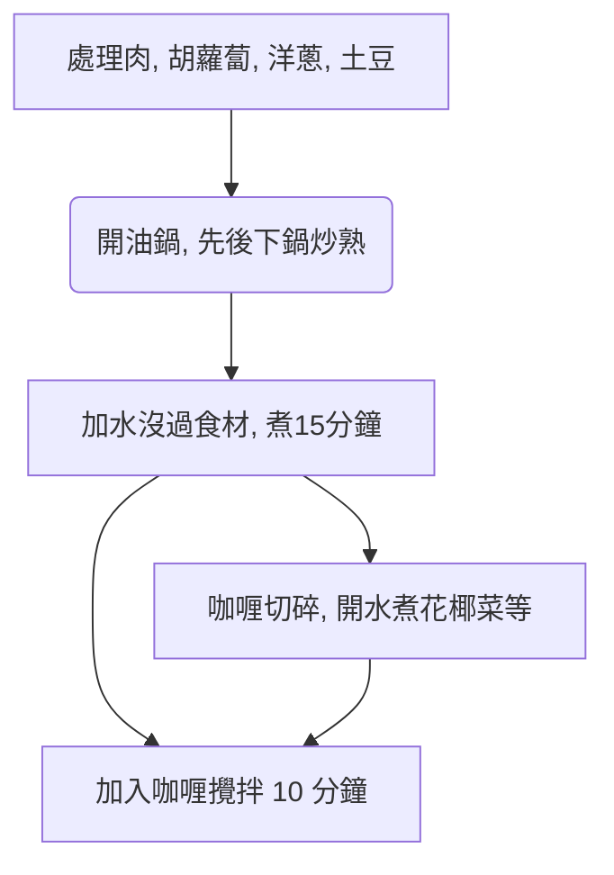

# 日式咖喱飯的做法

預估烹飪難度：★★★★

## 必備原料和工具

### 主食材

- 咖喱塊（推薦品牌好侍）
- 土豆
- 胡蘿蔔
- 洋蔥
- 肉（豬肉、雞肉、牛肉均可）
- 蒜頭

### 副食材

額外用作點綴的食材，可選

- 花椰菜（清水煮開）
- 培根（即食）
- 煎蛋或[太陽蛋](../../breakfast/太陽蛋.md)

## 計算

食材用量與咖喱成正比，計算部分以 **半盒好侍咖喱塊(115g)** 為例。半盒約六碗份，做好的咖喱在冰箱冷藏後風味更佳，不用擔心一個人吃不完。

- 洋蔥 2 個
- 土豆 2 個
- 胡蘿蔔 1 根
- 蒜頭 2~3 瓣
- 肉 2 斤

## 操作

### 1. 食材準備

- 胡蘿蔔去頭尾，去皮，滾刀切
- 洋蔥剝去外層去芯，切成月牙狀
- 土豆去皮、切大塊
- 肉切塊狀
- 剝蒜拍平切碎
- 咖喱塊切碎，增加接觸面積加速溶解

### 2. 燒煮過程

- 熱油鍋放入蒜和肉，**快速翻炒**至肉*表面變白*
- 加入胡蘿蔔，**快速翻炒**至均勻受熱
- 加入洋蔥，**快速翻炒**至洋蔥*變透明狀*
- 加入土豆，保持翻炒至土豆*變軟*（可以用筷子確認）
- 加水沒過所有食材，沸騰後**等待 15 分鐘**
- 關火，加咖喱並攪拌
- 等待咖喱融化後再開火，緩慢**攪拌 10 分鐘**，防止糊鍋
- 在外觀*呈粘稠狀態*關火結束製作

### 3.冷藏後加熱

冷藏的咖喱每次取出需要吃的份量，加熱後蓋在[米飯](../米飯/電飯煲蒸米飯.md)上。

- 微波爐：單人份高火 2-3 分鐘
- 鍋：需額外加 50ml 水，加熱時保持攪拌

## 附加內容

### 備註說明

- 步驟 1-6 可以在 2-5 的等待過程進行，在這個過程也可以用清水鍋煮些蔬菜，或做個煎蛋。
- 2-5 到 2-6 之間，需要注意觀察沸騰的水位線，如發現低於 2/3 的食材應加熱水至沒過食材。

### 流程圖解

### 成品

### 參考資料

- [世界美食教程的微博視頻](http://t.cn/EJ77yFy)

---
如果您遵循本指南的製作流程而發現有問題或可以改進的流程，請提出 Issue 或 Pull request 。
