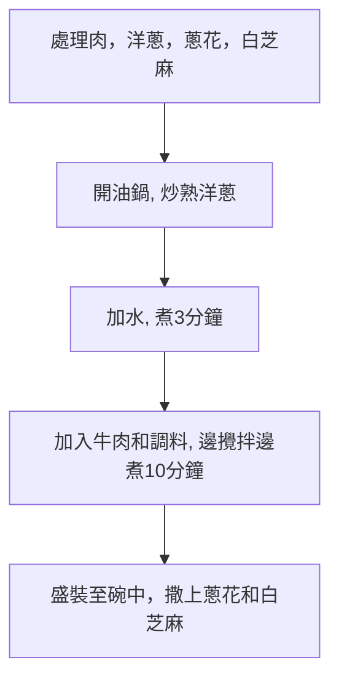

# 日式肥牛丼飯的做法

預估烹飪難度：★★★★

## 必備原料和工具

### 主食材

- 洋蔥（務必選用外皮為白黃色的洋蔥，不要用紫色的洋蔥）
- 肥牛（火鍋肥牛即可，也可選用原切肥牛片）
- 蔥（也可選用切好的蔥段）
- 白芝麻
- 味淋（一種常用日式調料，可在各大電商平臺購買，也可用料酒代替）

### 副食材

額外用作點綴的食材，可選

- [溫泉蛋](../../breakfast/溫泉蛋/溫泉蛋.md)
- 出汁（使用柴魚乾和昆布熬製的湯汁，可以用於提鮮）

## 計算

食材用量與米飯成正比，計算部分以 **一杯米(160ml)** 為例。約為二人食用分量，吃不完可以放冰箱冷藏，但可能會沒那麼好吃

- 洋蔥 1 個
- 肥牛 250 克
- 蔥 1~2 根
- 白芝麻 5 克

## 操作

### 1. 食材準備

- 洋蔥剝去外層去芯，切成月牙狀
- 蔥洗淨切成 0.5cm 的小段
- 熱鍋直接放入白芝麻，**前後晃動鍋體**使芝麻均勻受熱至*略呈金黃色*
- 肥牛焯水 1 分鐘後撈出
- 將 40g `味淋`（或 30g `料酒`），30g `醬油`，20g `耗油`，5g `糖`，5g `老抽`（可選，用於調色），在碗中攪拌混合成`調料`（該步驟可直接將碗放在電子秤上進行）

### 2. 燒煮過程

- 熱油鍋放入洋蔥，**快速翻炒**至洋蔥*變透明狀*
- 關小火，加入 250g 水（或出汁），開回大火加熱**等待 3 分鐘**
- 加入牛肉和`調料`
- **不斷翻動**所有食材 **10 分鐘**，防止食材粘鍋
- 關火
- 盛裝肥牛丼至[米飯](../米飯/電飯煲蒸米飯.md)上（注意要把汁水淋一些在飯上）
- 撒上蔥花和白芝麻，製作完成。

### 3.冷藏後加熱

冷藏的牛丼每次取出需要吃的份量，加熱後蓋在[米飯](../米飯/電飯煲蒸米飯.md)上。

- 微波爐：單人份高火 2-3 分鐘
- 鍋：需額外加 50ml 水，加熱時需**不斷翻動**

## 附加內容

```shell
struct Staple{float 鹹度;};
struct Staple 牛丼
牛丼.鹹度 = 嘗一口湯汁;
while(牛丼.鹹度 < 預期) 加入(1 g)醬油; 牛丼.鹹度 = 嘗一口湯汁;
```

### 備註說明

- 如果用的是比較不錯的牛肉，可以選擇不焯水，能夠更加保留牛肉的風味，因為加入了味淋所以不會很腥，無需擔心牛肉不熟，加熱 10 分鐘肯定熟了
- 如果有條件，選擇加入 15g`清酒`

### 流程圖解



### 成品


### 參考資料

- [河水洋洋實驗室 【牛丼｜肥牛飯】吉野家牛肉飯的正宗做法](https://www.bilibili.com/video/BV1rK4y1d7Fk)
- [夏叔廚房 60秒搞定神仙配方，好吃又下飯的肥牛飯！](https://www.bilibili.com/video/BV1xu4y1676X)

---
如果您遵循本指南的製作流程而發現有問題或可以改進的流程，請提出 Issue 或 Pull request 。
